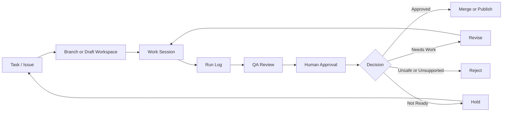
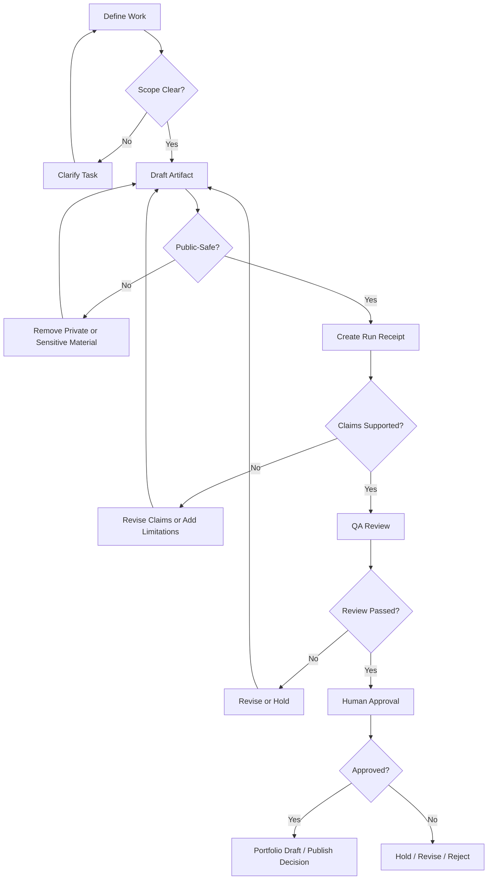
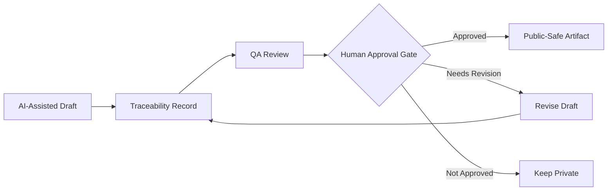
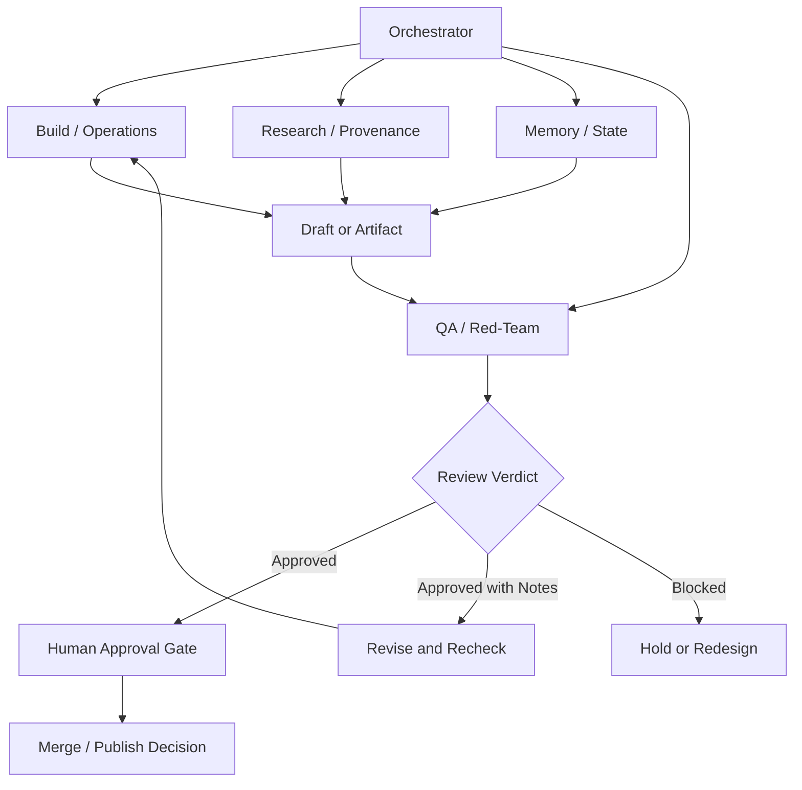
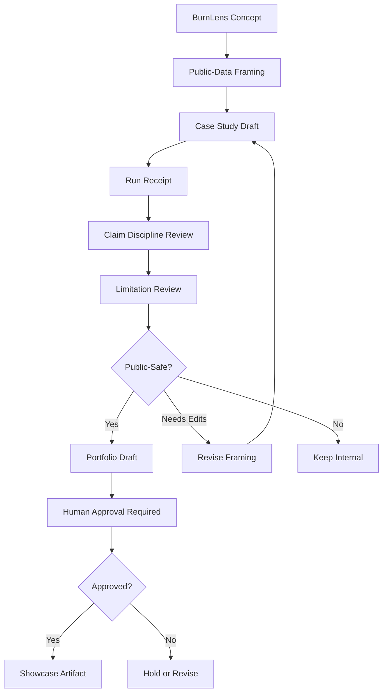
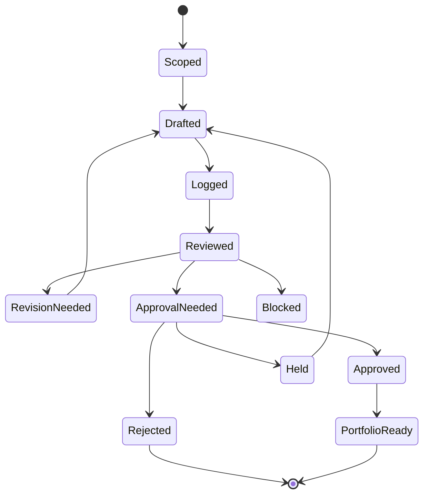
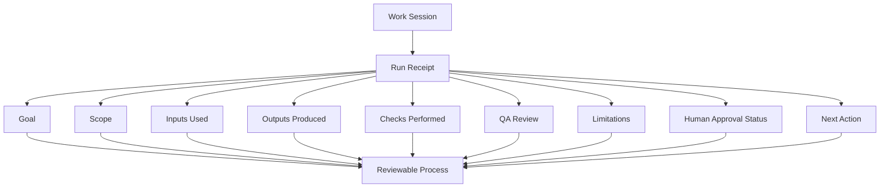
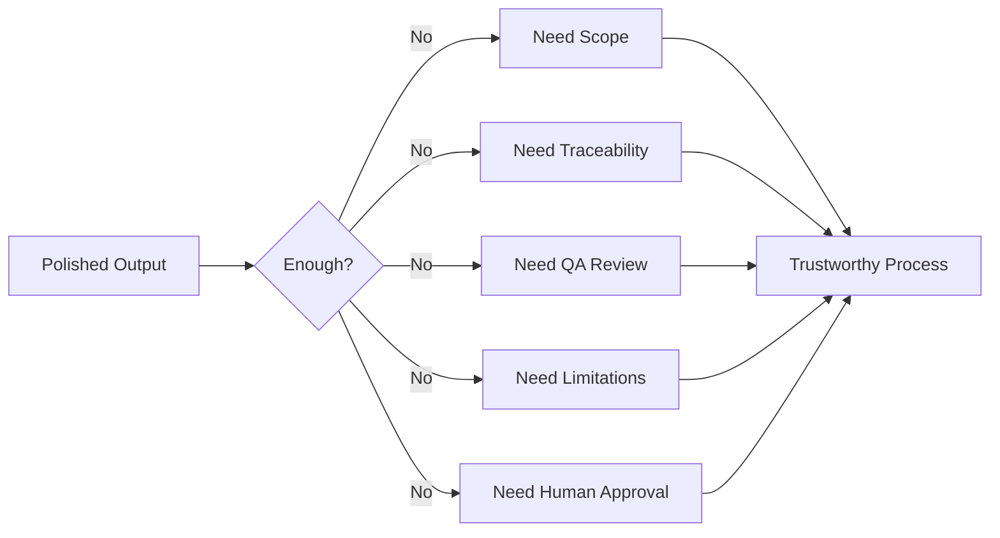

# Workflow Map

This document visualizes the public-safe workflow model behind OpenClaw Showcase.

OpenClaw is a closed-source agent-harness platform. This showcase does not expose the active runtime, private repository, raw logs, credentials, local configuration, operational memory, or live tool authority.

These diagrams show the public workflow pattern: how AI-assisted work is scoped, traced, reviewed, limited, and approved.

---

## How to Read These Diagrams

The diagrams are a visual companion to the written documents:

- [Agentic Studio Workflow](../docs/agentic-studio-workflow.md) explains the process in prose.
- [Safety Boundaries](../docs/safety-boundaries.md) defines the limits the diagrams represent.
- [Sanitized Run Receipt](../examples/sanitized-run-receipt.md) shows the traceability step as a concrete example.
- [BurnLens Case Study](../case-studies/burnlens/README.md) applies the workflow to a public-data concept.

GitHub renders Mermaid diagrams directly in Markdown, so this file is designed to be readable in the repository view.

---

## 1. Core OpenClaw Workflow



### What this shows

OpenClaw work does not move directly from prompt to publication. It passes through task scoping, traceability, QA review, and human approval before any merge or public release decision.

---

## 2. Workflow With Safety Gates



### What this shows

The workflow checks more than whether an artifact reads well. It checks whether the work is scoped, public-safe, supported, reviewed, and approved.

---

## 3. Human Approval Boundary



### Human approval is required before

- Publishing public-facing artifacts.
- Treating a draft as final.
- Presenting a case study as portfolio-ready.
- Expanding tool authority.
- Discussing runtime behavior publicly.
- Changing safety boundaries.
- Exposing implementation details.

---

## 4. Role-Based Review Loop



### Public-facing role labels

OpenClaw uses role-based workflow concepts. This showcase describes them by function:

| Role | Public Function |
|---|---|
| Orchestrator | Defines the task, coordinates the run, and consolidates results. |
| Build / Operations | Creates artifacts, runs checks, and reports changes. |
| Research / Provenance | Reviews assumptions, sources, and limitations. |
| Memory / State | Tracks continuity, decisions, and current project state. |
| QA / Red-Team | Reviews output and process for risk, scope drift, and overclaiming. |

These roles are workflow functions. They do not imply unchecked autonomy or public runtime exposure.

---

## 5. Public Showcase Boundary

```mermaid
flowchart LR
    subgraph Private_System[Private System Boundary]
        A[Closed-Source Runtime]
        B[Private Working Repo]
        C[Operational Memory]
        D[Raw Logs]
        E[Credentials / Secrets]
        F[Runtime Configuration]
        G[Live Tool Authority]
    end

    subgraph Public_Showcase[Public Showcase Boundary]
        H[README]
        I[Security Posture]
        J[Safety Boundaries]
        K[Workflow Documentation]
        L[Sanitized Run Receipt]
        M[BurnLens Case Study]
        N[Workflow Diagrams]
    end

    Private_System -. Sanitized lessons only .-> Public_Showcase
```



### What this shows

The public showcase explains the workflow. It does not expose the private runtime, private operating environment, credentials, raw logs, or live authority paths.

---

## 6. BurnLens Showcase Path



### What this shows

BurnLens is handled as a bounded public-data wildfire planning concept. The workflow prevents it from being presented as an operational emergency-response system, live monitoring tool, predictive risk model, or production-ready GeoAI platform.

---

## 7. Draft Status Lifecycle



### What this shows

An artifact can have several states before it becomes portfolio-ready. The workflow allows revision, holding, or rejection instead of assuming every AI-assisted draft should be published.

---

## 8. Traceability Receipt Model



### What this shows

A run receipt is not a raw log. It is a public-safe process record that makes the work easier to understand and review.

---

## 9. Key Operating Principle



### Core idea

A polished artifact is not enough.

OpenClaw Showcase emphasizes the process around the artifact:

```text
Scoped → Traced → Reviewed → Limited → Approved
```

---

## Relationship to Other Showcase Files

- [OpenClaw Showcase README](../README.md)
- [Security Posture](../SECURITY-POSTURE.md)
- [Safety Boundaries](../docs/safety-boundaries.md)
- [Agentic Studio Workflow](../docs/agentic-studio-workflow.md)
- [Sanitized Run Receipt](../examples/sanitized-run-receipt.md)
- [BurnLens Case Study](../case-studies/burnlens/README.md)

---

## Summary

These diagrams present OpenClaw as an AI operations workflow, not as an uncontrolled automation system.

The public showcase highlights the visible process:

```text
Task → Draft → Trace → Review → Approve
```

The private system retains the runtime, configuration, credentials, operational memory, raw logs, and live tool authority.
